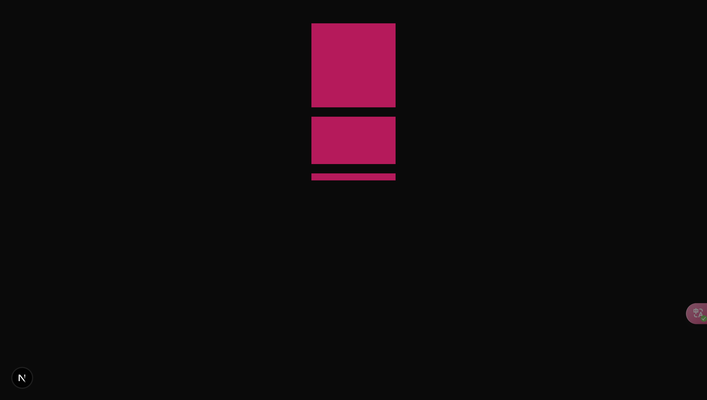

# p2-layout.md

- https://tailwindcss.com/

## aspect-ratio

>[!INFO] 
>
> - https://tailwindcss.com/docs/aspect-ratio
>
> 用于控制元素长宽比

```tsx
<div className={"flex flex-col items-center justify-center gap-4 mt-10"}>
    <div className={"bg-pink-700 w-36 aspect-square"}/>
    <div className={"bg-pink-700 w-36 aspect-video"}/>
    <div className={"bg-pink-700 w-36 aspect-[12/1]"}/>
</div>
```


