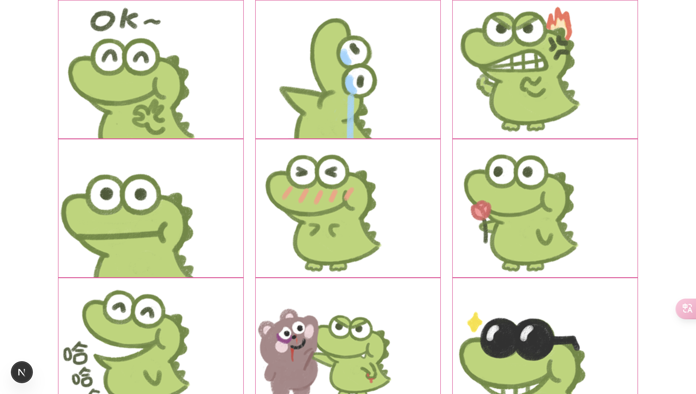
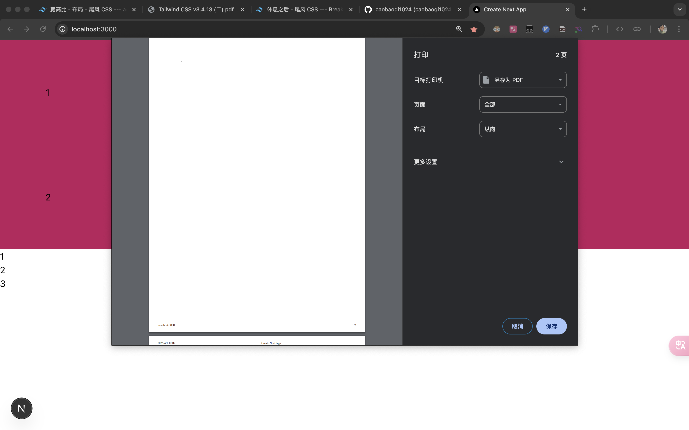
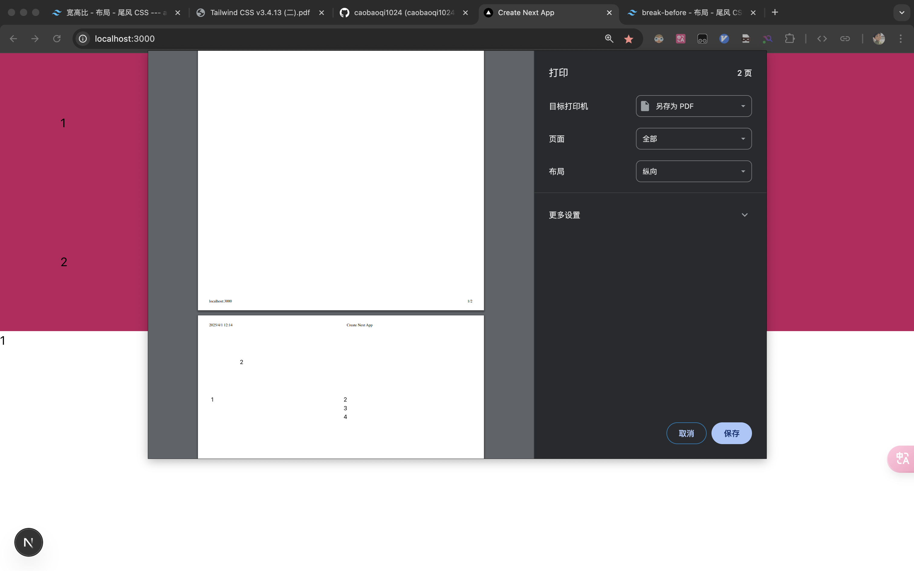
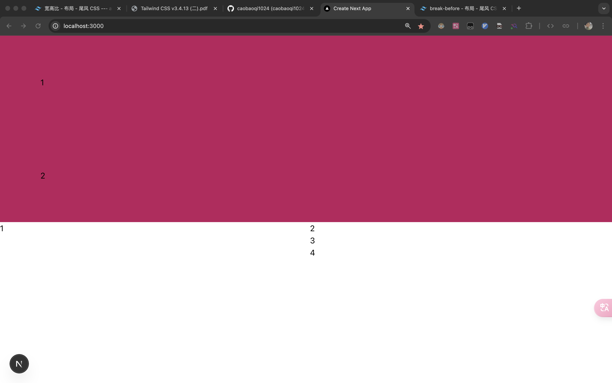
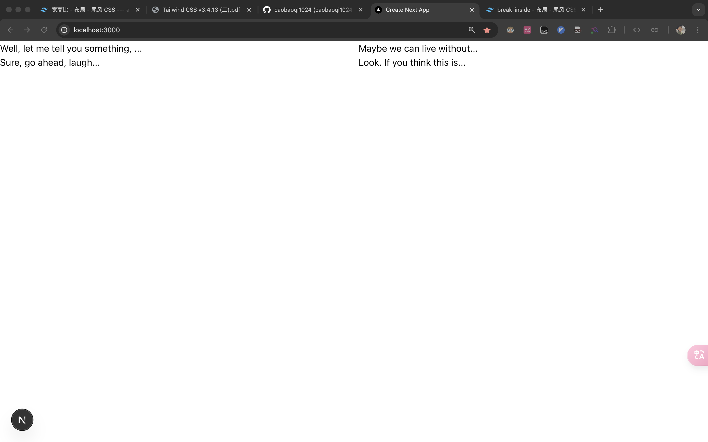
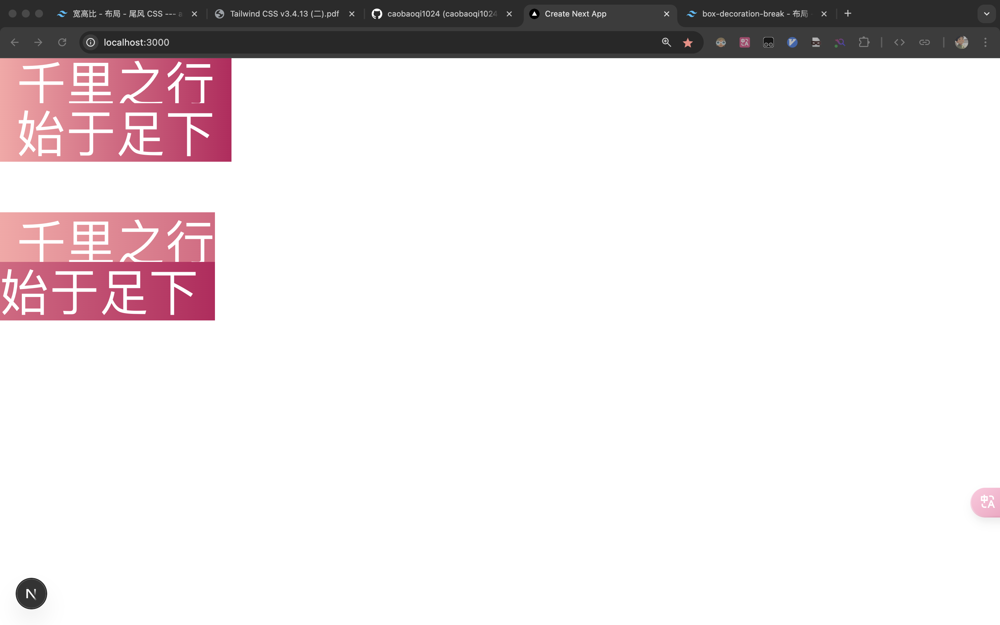
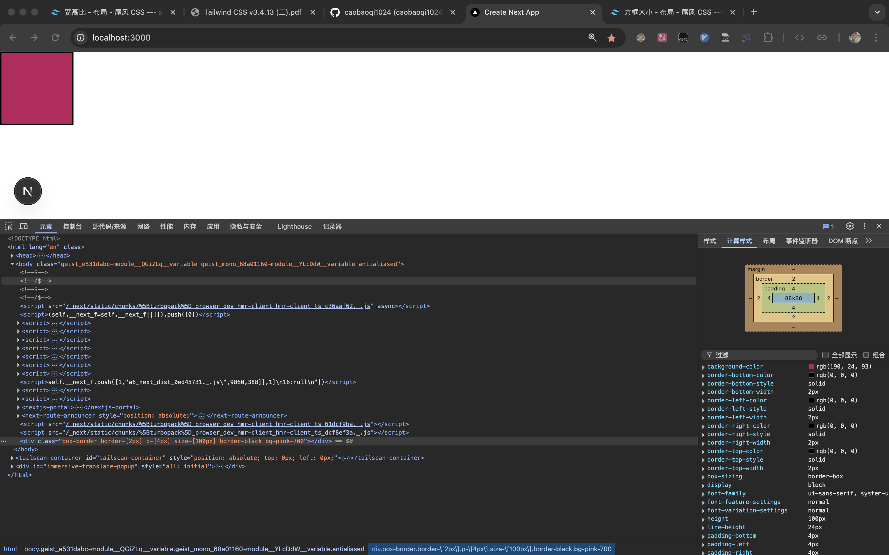
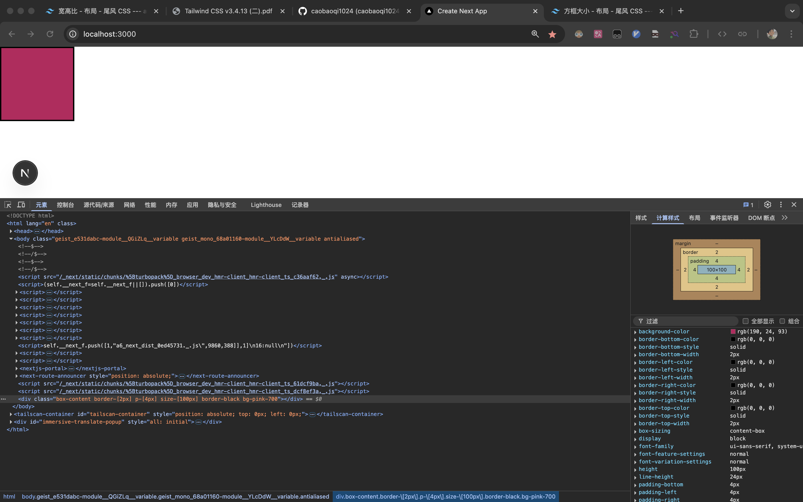
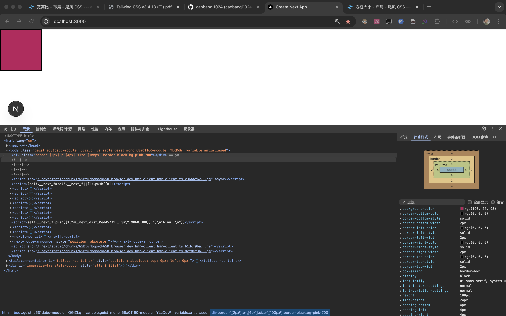

# p2-layout.md

https://v3.tailwindcss.com/docs/container

# aspect-ratio

> [!NOTE]
> 
>[aspect-*](https://v3.tailwindcss.com/docs/aspect-ratio) 用于控制元素长宽比

示例

```tsx
<div className={"flex flex-col items-center justify-center gap-4 mt-10"}>
    <div className={"bg-pink-700 w-36 aspect-square"}/>
    <div className={"bg-pink-700 w-36 aspect-video"}/>
    <div className={"bg-pink-700 w-36 aspect-[12/1]"}/>
</div>
```


# container

> [!NOTE]
> 
>[container](https://v3.tailwindcss.com/docs/container) 用于将元素宽度固定为当前断点的组件将元素的 `max-width` 设置为与当前断点的 `min-width` 匹配。如果您希望针对一组固定的屏幕尺寸进行设计，而不是试图适应完全流动的视口，那么这将非常有用。

| Class          | Breakpoint         | Properties   |
| -------------- | ------------------ | ------------ |
| container      | None               | width: 100%; |
| sm *(640px)*   | max-width: 640px;  |              |
| md *(768px)*   | max-width: 768px;  |              |
| lg *(1024px)*  | max-width: 1024px; |              |
| xl *(1280px)*  | max-width: 1280px; |              |
| 2xl *(1536px)* | max-width: 1536px; |              |

> [!WARNING]
>
> 请注意，与您可能在其他框架中使用过的容器不同， **tailwind css 的容器不会自动居中，也没有任何内置水平填充。** 要使容器居中，请使用 `mx-auto` :
>
> ```tsx
><div class="container mx-auto">
> <!-- ... -->
> </div>
>   ```
> 
> 要添加水平填充，请使用 `px-*` :
>
> ```tsx
><div class="container mx-auto px-4">
> <!-- ... -->
> </div>
>   ```

要使容器默认居中，请在配置文件 `tailwind.config.js` 的 `theme.container` 部分中将 `center` 选项设置为 `true` 

```js
/** @type {import('tailwindcss').Config} */
module.exports = {
  theme: {
    container: {
      center: true,
    },
  },
}
```

示例

```tsx
export default function Home() {
    return (
        <>
            <div className={"bg-pink-700 h-72 w-full md:w-10/12 md:mx-auto lg:w-3/4"}/>
        </>
    );
}

```


# columns

> [!NOTE] 
>
> [columns](https://v3.tailwindcss.com/docs/columns) 是用于控制元素内列数的实用工具
>
> - 使用 `columns-2` 和 `columns-3` 等来设置应为元素内的内容创建的列数。列宽将自动调整以适应该数量。
> - 使用 `columns-xs` 和 `columns-sm` 等可为元素内的内容设置理想的列宽，并自动调整列数（计数）以适应该值。
> - 要指定列之间的宽度，可以使用 `gap-x`
> - tailwind 允许您使用变体修饰符在不同状态下有条件地应用实用工具类。例如，使用 `hover:columns-3` 只在悬停时应用 `columns-3` 工具。

| Class                 | Properties                                              |
| --------------------- | ------------------------------------------------------- |
| columns-1             | columns: 1;                                             |
| columns-2             | columns: 2;                                             |
| columns-3             | columns: 3;                                             |
| ...                   | ...                                                     |
| columns-auto          | columns: auto;                                          |
| columns-3xs           | columns: 16rem; /* 256px */                             |
| columns-2xs           | columns: 18rem; /* 288px */                             |
| columns-xs            | columns: 20rem; /* 320px */                             |
| ...                   | ...                                                     |
| columns-5xlcolumns-sm | columns: 64rem; /* 1024px */columns: 24rem; /* 384px */ |
| columns-6xlcolumns-md | columns: 72rem; /* 1152px */columns: 28rem; /* 448px */ |
| columns-7xlcolumns-lg | columns: 80rem; /* 1280px */columns: 32rem; /* 512px */ |

示例

````tsx
import {imgList} from "@/components/mcdd"

export default function Home() {
    return (
        <>
            <div className={"w-10/12 mx-auto columns-2 hover:columns-xs gap-x-5"}>
                {
                    imgList.map((img, index) => {
                        return (
                            <div key={index} className={"border-[1px] border-pink-500"}>
                                
                            </div>
                        )
                    })
                }
            </div>
        </>
    );
}

````



# break-after | before | inside

> [!NOTE]
>
>
> -  [break-after-*](https://v3.tailwindcss.com/docs/break-after) 工具可控制元素后的分栏或分页符的行为。例如，使用 `break-after-column` 可在元素后强制分栏。 
> - 使用 `break-before-column` 和 `break-before-page` 等实用工具来控制元素前的分栏或分页符的行为

示例

```tsx
export default function Home() {
    return (
        <>
            <div className={"p-20 bg-pink-700 print:break-after-page"}>1</div>
            <div className={"p-20 bg-pink-700"}>2</div>
            <ul className={"columns-2"}>
                <li>1</li>
                <li>2</li>
                <li className={"break-after-column"}>3</li>
                <li>4</li>
            </ul>
        </>
    );
}
```




示例

```tsx
export default function Home() {
    return (
        <>
            <div className={"p-20 bg-pink-700"}>1</div>
            <div className={"p-20 bg-pink-700 print:break-before-page"}>2</div>
            <ul className={"columns-2"}>
                <li>1</li>
                <li className={"break-before-column"}>2</li>
                <li>3</li>
                <li>4</li>
            </ul>
        </>
    );
}

```





示例

```tsx
export default function Home() {
    return (
        <>
            <div className="columns-2">
                <p>Well, let me tell you something, ...</p>
                <p className="break-inside-avoid-column">Sure, go ahead, laugh...</p>
                <p>Maybe we can live without...</p>
                <p>Look. If you think this is...</p>
            </div>
        </>
    );
}

```



# box-decoration-break

https://tailwindcss.com/docs/box-decoration-break

> 使用 `box-decoration-slice` 和 `box-decoration-clone` 实用程序，可以控制背景、边框、边框图像、框阴影、剪贴路径、边距和衬垫等属性的呈现方式是将元素视为一个连续的片段，还是不同的块

示例

```tsx
export default function Home() {
    return (
        <>
            <span className={"px-5 text-6xl text-white bg-gradient-to-r from-red-300 to-pink-700 box-decoration-clone"}>
                千里之行 <br /> 始于足下
            </span>
            <br />
            <br />
            <br />
            <br />
            <span className={"px-5 text-6xl text-white bg-gradient-to-r from-red-300 to-pink-700 box-decoration-slice"}>
                千里之行 <br /> 始于足下
            </span>
        </>
    );
}

```



# box-sizing

https://tailwindcss.com/docs/box-sizing

> - 使用 `box-border` 将元素的 `box-sizing` 设置为 `border-box`，告诉浏览器在给元素设置高度或宽度时包含其边框和填充。这意味着一个 100px × 100px 的元素，如果边框为 2px，四边的填充为 4px，则会显示为 100px × 100px，内部内容区域为 88px × 88px：

示例

```tsx
export default function Home() {
    return (
        <>
            <div className={"box-border border-[2px] p-[4px] size-[100px] border-black bg-pink-700"}>

            </div>
        </>
    );
}

```




> 使用 `box-content` 将元素的 `box-sizing` 设置为 `content-box`，告诉浏览器在元素指定宽度或高度的基础上添加边框和填充。这意味着，一个 100px × 100px 的元素，边框为 2px，四边填充为 4px，实际呈现为 112px × 112px，内部内容区域为 100px × 100px：

示例

```tsx
export default function Home() {
    return (
        <>
            <div className={"box-content size-[100px] border-[2px] p-[4px] border-black bg-pink-700"}>

            </div>
        </>
    );
}

```



> [!TIP]
>
> tailwind 初始化将盒子设置为 box-border

示例

```tsx
export default function Home() {
    return (
        <>
            <div className={"border-[2px] p-[4px] size-[100px] border-black bg-pink-700"}>

            </div>
        </>
    );
}

```


