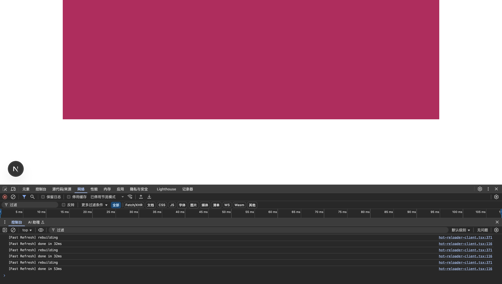

# p2-layout.md

https://v3.tailwindcss.com/docs/container

# aspect-ratio

> 用于控制元素长宽比
>
> - https://v3.tailwindcss.com/docs/aspect-ratio

示例

```tsx
<div className={"flex flex-col items-center justify-center gap-4 mt-10"}>
    <div className={"bg-pink-700 w-36 aspect-square"}/>
    <div className={"bg-pink-700 w-36 aspect-video"}/>
    <div className={"bg-pink-700 w-36 aspect-[12/1]"}/>
</div>
```


# container

> 用于将元素宽度固定为当前断点的组件：`container` 类将元素的 `max-width` 设置为与当前断点的 `min-width` 匹配。如果您希望针对一组固定的屏幕尺寸进行设计，而不是试图适应完全流动的视口，那么这将非常有用。
>
> - https://v3.tailwindcss.com/docs/container

| Class          | Breakpoint         | Properties   |
| -------------- | ------------------ | ------------ |
| container      | None               | width: 100%; |
| sm *(640px)*   | max-width: 640px;  |              |
| md *(768px)*   | max-width: 768px;  |              |
| lg *(1024px)*  | max-width: 1024px; |              |
| xl *(1280px)*  | max-width: 1280px; |              |
| 2xl *(1536px)* | max-width: 1536px; |              |

> [!WARN]
>
> 请注意，与您可能在其他框架中使用过的容器不同， **tailwind css 的容器不会自动居中，也没有任何内置水平填充。**
>
> 要使容器居中，请使用 `mx-auto` :
>
> ```tsx
> <div class="container mx-auto">
>   <!-- ... -->
> </div>
> ```
>
> 要添加水平填充，请使用 `px-*` :
>
> ```tsx
> <div class="container mx-auto px-4">
>   <!-- ... -->
> </div>
> ```

要使容器默认居中，请在配置文件 `tailwind.config.js` 的 `theme.container` 部分中将 `center` 选项设置为 `true` 

```js
/** @type {import('tailwindcss').Config} */
module.exports = {
  theme: {
    container: {
      center: true,
    },
  },
}
```

示例

```tsx
export default function Home() {
    return (
        <>
            <div className={"bg-pink-700 h-72 w-full md:w-10/12 md:mx-auto lg:w-3/4"}/>
        </>
    );
}

```



